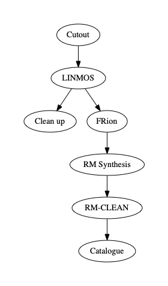

Running the pipeline
--------------------
So you're ready to run the pipeline? The SPICE-RACS pipeline picks up from whatever imaging routine you used to create the image cubes. You'll need to have image cubes in a working directory all convolved to a common spatial resolution. You should also make sure the names of the image cubes are consistent with the naming convention used in the ASKAPsoft pipline i.e. ::

    working_directory/image.restored.{i,q,u}*contcube*beam{00..36}.conv.fits

:code:`processSPICE` orchestrates the pipeline flow using `Prefect <https://prefect.io>`_ and `Dask <https://dask.org>`_. This script calls the other :code:`spiceracs` modules to do the work. You can control which modules run in the configuration of :code:`processSPICE`, or run the modules individually. :code:`processSPICE` operates on the level of a single RACS fields, currently.

Details of each module can be found in the API documentation. But broadly the stages are:

    * Cutout - Finds the position of the source in the image cubes and cuts out a square region around it.

    * LINMOS - Applies the primary beam and leakage correction to the cutout beam cubes, and then mosaics each into a single cube for each source per field.

    * Clean up - Remove the cutout beam cubes from the cutouts directory.

    * FRion - Applies time-independent ionospheric Faraday rotation to the mosaicked cubes using `FRion <https://frion.readthedocs.io/en/latest/index.html/>`_.

    * RM synthesis - Extracts 1D spectra for each component of each source and runs RM synthesis using `RM-tools <https://github.com/CIRADA-Tools/RM-Tools>`_.

    * RM-CLEAN - Runs RM-CLEAN on the extracted 1D spectra using `RM-tools <https://github.com/CIRADA-Tools/RM-Tools>`_.

    * Catalogue - Queries the database for a given field and constructs a polarisation catalogue for each component.

.. rst-class::  clear-both

With an initalised database you can call the pipeline: ::

    (spice) $ processSPICE -h
    usage: processSPICE [-h] [--config CONFIG] [-v] [-vw] [-p PAD] [--dryrun]
                        [--dimension DIMENSION] [-m] [--validate] [--limit LIMIT]
                        [-sp] [-w WEIGHTTYPE] [-t] [-l PHIMAX_RADM2]
                        [-d DPHI_RADM2] [-s NSAMPLES] [-o POLYORD] [-i]
                        [--showPlots] [-R] [-rmv] [-D] [-c CUTOFF] [-n MAXITER]
                        [-g GAIN] [--outfile OUTFILE] [-f FORMAT]
                        field datadir host

        
         mmm   mmm   mmm   mmm   mmm
         )-(   )-(   )-(   )-(   )-(
        ( S ) ( P ) ( I ) ( C ) ( E )
        |   | |   | |   | |   | |   |
        |___| |___| |___| |___| |___|
         mmm     mmm     mmm     mmm
         )-(     )-(     )-(     )-(
        ( R )   ( A )   ( C )   ( S )
        |   |   |   |   |   |   |   |
        |___|   |___|   |___|   |___|

        
        SPICE-RACS pipeline.

        Before running make sure to start a session of mongodb e.g.
            $ mongod --dbpath=/path/to/database --bind_ip $(hostname -i)

        

    positional arguments:
    field                 Name of field (e.g. 2132-50A).
    datadir               Directory containing data cubes in FITS format.
    host                  Host of mongodb (probably $hostname -i).

    optional arguments:
    -h, --help            show this help message and exit
    --config CONFIG       Config file path

    output options:
    -v, --verbose         Verbose output [True].
    -vw, --verbose_worker
                            Verbose worker output [False].

    cutout arguments:
    -p PAD, --pad PAD     Number of beamwidths to pad around source [5].
    --dryrun              Do a dry-run [False].

    RM-synth/CLEAN arguments:
    --dimension DIMENSION
                            How many dimensions for RMsynth [1d] or '3d'.
    -m, --database        Add RMsynth data to MongoDB [False].
    --validate            Run on RMsynth Stokes I [False].
    --limit LIMIT         Limit number of sources [All].

    RM-tools arguments:
    -sp, --savePlots      save the plots [False].
    -w WEIGHTTYPE, --weightType WEIGHTTYPE
                            weighting [variance] (all 1s) or 'variance'.
    -t, --fitRMSF         Fit a Gaussian to the RMSF [False]
    -l PHIMAX_RADM2, --phiMax_radm2 PHIMAX_RADM2
                            Absolute max Faraday depth sampled (overrides NSAMPLES) [Auto].
    -d DPHI_RADM2, --dPhi_radm2 DPHI_RADM2
                            Width of Faraday depth channel [Auto].
    -s NSAMPLES, --nSamples NSAMPLES
                            Number of samples across the FWHM RMSF.
    -o POLYORD, --polyOrd POLYORD
                            polynomial order to fit to I spectrum [3].
    -i, --noStokesI       ignore the Stokes I spectrum [False].
    --showPlots           show the plots [False].
    -R, --not_RMSF        Skip calculation of RMSF? [False]
    -rmv, --rm_verbose    Verbose RMsynth/CLEAN [False].
    -D, --debug           turn on debugging messages & plots [False].
    -c CUTOFF, --cutoff CUTOFF
                            CLEAN cutoff (+ve = absolute, -ve = sigma) [-3].
    -n MAXITER, --maxIter MAXITER
                            maximum number of CLEAN iterations [10000].
    -g GAIN, --gain GAIN  CLEAN loop gain [0.1].

    catalogue arguments:
    --outfile OUTFILE     File to save table to [None].
    -f FORMAT, --format FORMAT
                            Format for output file [None].

    Args that start with '--' (eg. -v) can also be set in a config file
    (.default_config.txt or specified via --config). Config file syntax allows:
    key=value, flag=true, stuff=[a,b,c] (for details, see syntax at
    https://goo.gl/R74nmi). If an arg is specified in more than one place, then
    commandline values override config file values which override defaults.

You can optionally pass a configuration file (with the :code:`--config` argument) to set the options you prefer. An example file in contained in :file:`spiceracs/.default_config.txt`.
